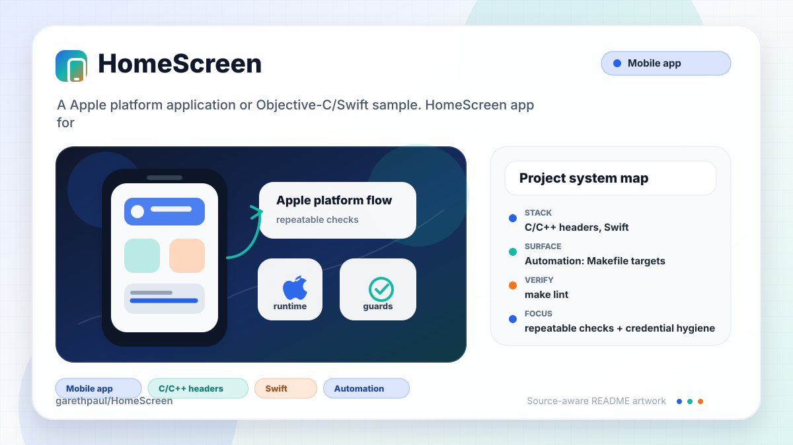

# HomeScreen

<!-- README-OVERVIEW-IMAGE -->


## Overview

`garethpaul/HomeScreen` is a Apple platform application or Objective-C/Swift sample. HomeScreen app for for sharing your #Homescreen

This README is based on the checked-in source, manifests, scripts, and repository metadata on the `master` branch. The project language mix found during review was: C/C++ headers (23), Swift (19).

## Repository Contents

- `CHANGES.md` - concise history of maintenance changes
- `Crashlytics.framework` - source or example code
- `Fabric.framework` - source or example code
- `HomeScreen` - source or example code
- `HomeScreen.xcodeproj` - Xcode project file
- `HomeScreenTests` - source or example code
- `Makefile` - local verification entry point
- `SECURITY.md` - security reporting and disclosure guidance
- `scripts/check-baseline.py` - static iOS sharing and privacy verifier
- `TwitterKit.framework` - source or example code
- `VISION.md` - project direction and maintenance guardrails

Additional scan context:

- Source directories: Crashlytics.framework, Fabric.framework, HomeScreen, HomeScreenTests, TwitterKit.framework
- Dependency and build manifests: none detected
- Entry points or build surfaces: `make check`, HomeScreen.xcodeproj
- Test-looking files: HomeScreen/UpdateStatus.swift, HomeScreenTests/HomeScreenTests.swift, HomeScreenTests/Info.plist

## Getting Started

### Prerequisites

- Git
- macOS with Xcode for building Apple platform projects
- Python 3 for local static verification on non-macOS hosts

### Setup

```bash
git clone https://github.com/garethpaul/HomeScreen.git
cd HomeScreen
make lint
make test
make build
make check
```

The setup commands above are derived from repository files. The checked-in frameworks are legacy Fabric/TwitterKit-era artifacts, so a full build may require matching Xcode and iOS SDK versions.

## Running or Using the Project

- Open `HomeScreen.xcodeproj` in Xcode, choose the app or sample scheme, and run it on the matching simulator/device.
- Provide Fabric values through local Xcode build settings or environment-backed xcconfig values:
  - `FABRIC_API_KEY`
  - `FABRIC_BUILD_SECRET`
- Keep the `NSPhotoLibraryUsageDescription` plist entry aligned with the screenshot preview/share flow whenever photo access changes.

## Testing and Verification

Run the local static baseline:

```bash
make lint
make test
make build
make check
```

The `lint`, `test`, and `build` targets intentionally alias the maintained
baseline on hosts without the legacy Xcode toolchain, so the standard local gate
commands stay available while preserving the single source of truth.

The baseline runs `scripts/check-baseline.py` plus mutation-sensitive async
ownership checks. It parses plist/storyboard/workspace XML, checks the Xcode
project metadata, verifies the legacy Swift and framework inventory, and guards
against checked-in Fabric credential literals, missing photo-library permission
text, unsafe empty-screenshot uploads, repeated or stale screenshot completion,
nil-safe screenshot fallback behavior, Twitter/profile image and write response
handling, missing Twitter
session guards on the share screen, raw Twitter upload-response logging,
deprecated update_with_media helper code, and invalid hex color parsing.
It also guards JPEG media data creation so screenshot uploads use a valid
compression quality and skip upload when image encoding fails.
It also guards tweet feed failures so search/login errors complete safely and
the loading indicator is cleared without force-casting returned tweet objects.
Profile-image lookup now completes with an optional result on request,
transport, JSON, and missing-field failures so share-screen setup cannot wait
indefinitely for a callback.
Media upload now completes with an optional identifier on request, transport,
response, JSON, and missing-ID failures. Upload request and connection objects
are not logged, and status submission requires a non-nil media identifier.
The share composer dismisses only after Twitter confirms status creation;
upload and status failures keep the composer visible.
Share post callbacks are generation-bound so duplicate taps and stale completions cannot dismiss the composer.
Tweet feed callbacks are generation-bound so only the latest initial or refresh
request may replace the table and finish its spinner.
It reads Twitter's `profile_image_url_https` field so dynamic response URLs
cannot downgrade profile image downloads to cleartext HTTP.
The avatar remains hidden during lookup and is revealed only after a successful profile image download
and image assignment.

The pinned GitHub Actions check runs `make check` on `macos-15`. When Xcode is
available, the baseline also runs `xcodebuild -list -project HomeScreen.xcodeproj`
to verify that the checked-in project can be parsed by the hosted toolchain.
This does not exercise retired Twitter/Fabric services, account credentials,
signing, simulator behavior, or the end-to-end sharing flow.

For full legacy verification on macOS, use Xcode's test action or `xcodebuild test` with the appropriate scheme and destination.

When the required SDK or runtime is unavailable, use static checks and source review first, then verify on a machine that has the matching platform toolchain.

## Configuration and Secrets

- Detected references to Twitter. Keep API keys, OAuth credentials, tokens, and account-specific values in local configuration only.
- The Fabric upload build phase reads `FABRIC_API_KEY` and `FABRIC_BUILD_SECRET` locally and skips the upload when either value is unset.
- Do not commit real Fabric, Twitter, signing, screenshot, or local xcconfig values to this repository.

## Security and Privacy Notes

- Review changes touching authentication or token handling; examples from the scan include Crashlytics.framework/Versions/A/Headers/Crashlytics.h, HomeScreen/AppDelegate.swift, HomeScreen/LoginController.swift, HomeScreen/ShareController.swift, and 6 more.
- Review changes touching external API calls or credential-adjacent configuration; examples from the scan include Crashlytics.framework/Versions/A/Headers/Crashlytics.h, Crashlytics.framework/Versions/A/Resources/Info.plist, Fabric.framework/Versions/A/Headers/Fabric.h, Fabric.framework/Versions/A/Resources/Info.plist, and 6 more.
- Review changes touching network requests, sockets, or service endpoints; examples from the scan include Crashlytics.framework/Versions/A/Resources/Info.plist, Fabric.framework/Versions/A/Resources/Info.plist, HomeScreen/Info.plist, HomeScreen/Settings.bundle/Root.plist, and 6 more.
- Review changes touching mobile permissions or privacy-sensitive device data; examples from the scan include HomeScreen/Post.swift, TwitterKit.framework/Versions/A/Headers/TWTRConstants.h.
- Review changes touching file, media, JSON, XML, CSV, OCR, or data parsing; examples from the scan include Crashlytics.framework/Versions/A/Resources/Info.plist, Fabric.framework/Versions/A/Resources/Info.plist, HomeScreen/Images.swift, HomeScreen/Info.plist, and 6 more.
- Review changes touching database, model, or persistence code; examples from the scan include HomeScreen/TweetsController.swift, TwitterKit.framework/Versions/A/Headers/TWTRTweetTableViewCell.h, TwitterKit.framework/Versions/A/Headers/TWTRTweetViewDelegate.h.
- Home screen screenshots can reveal private apps, messages, accounts, or location hints. Keep uploads user-initiated and avoid raw response or image logging.
- Twitter profile, search, guest-login, and tweet-model failures log only stable
  categories; raw request, transport, and localized error details stay out of
  learner-facing diagnostics.
- Treat Twitter session state as optional on presentation paths; expired or
  missing sessions should not crash profile-image rendering.
- Profile image callbacks are generation-bound to the visible share screen.
- Tweet search, guest-login, model-load, and UI completion callbacks are weakly
  owned and bound to the latest request generation.
- Treat tweet feed failures as recoverable; Twitter search or guest-login
  failures should complete without leaking loading state.

## Maintenance Notes

- Every Make verification target derives the checkout root from the loaded
  Makefile, so an absolute Makefile path works from any working directory,
  including checkout paths containing spaces.

This is an archival Swift 1-era baseline with an iOS 8.1 deployment target and
vendored Fabric, Crashlytics, and TwitterKit binaries. Those services and SDKs
are retired, so the project is not expected to build unchanged with a current
SDK. Follow `docs/plans/2026-06-10-legacy-sdk-modernization-boundary.md` and
replace the integrations before attempting a broad Swift or deployment-target
migration.

- This looks like an Apple platform project or sample. Xcode, Swift, CocoaPods, and deployment target versions may need to match the original project era.
- See `SECURITY.md` for vulnerability reporting and safe research guidance.
- See `VISION.md` for project direction and contribution guardrails.
- See `docs/plans/2026-06-08-response-nil-safety.md` for the Twitter/image response nil-safety guardrail.
- See `docs/plans/2026-06-08-write-response-data-guard.md` for the Twitter write response data guardrail.
- See `docs/plans/2026-06-09-screenshot-nil-safety.md` for the Photos screenshot nil-safety guardrail.
- See `docs/plans/2026-06-09-share-session-guard.md` for the share-screen Twitter session guardrail.
- See `docs/plans/2026-06-09-deprecated-update-with-media-removal.md` for the
  deprecated update_with_media removal guardrail.
- See `docs/plans/2026-06-09-jpeg-media-data-guard.md` for the JPEG media data
  upload guardrail.
- See `docs/plans/2026-06-09-tweet-feed-failure-guard.md` for the tweet feed
  failures guardrail.
- See `docs/plans/2026-06-10-profile-image-completion.md` for total
  profile-image lookup completion semantics.
- See `docs/plans/2026-06-09-make-gate-aliases.md` for the local gate alias guardrail.
- Run `make lint`, `make test`, `make build`, and `make check` before pushing changes to plist files, Swift sources, Xcode project metadata, credential handling, or screenshot-sharing behavior.

## Contributing

Keep changes small and tied to the project that is already present in this repository. For code changes, document the toolchain used, avoid committing generated dependency directories or local configuration, and update this README when setup or verification steps change.
